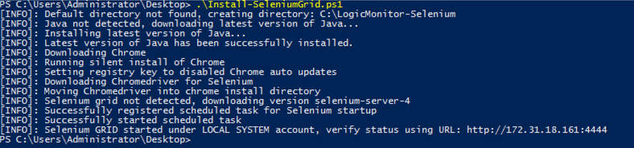

# Selenium Grid Version 4 Installation and Configuration (Using Chrome)

### Step 1: Ensure you have a windows/linux collector deployed to you LogicMonitor Portal

#### Info: https://www.logicmonitor.com/support/collectors/collector-installation/installing-collectors

### Step 2: Follow the setup instructions for Windows or Linux depending on your collector OS:

#### Step 2a: Windows Selenium GRID Setup (Automatic)

Run the following commands from an administrative PowerShell session to automatically prepare your machine to run Selenium GRID (can be same host as collector):

```powershell
#Download and run directly from PS session
Invoke-RestMethod -Uri "https://raw.githubusercontent.com/stevevillardi/LogicMonitor_Scripts/main/Selenium%20Grid%20(Syntehtics%20Test)/Install-SeleniumGrid.ps1" -OutFile Install-SeleniumGrid.ps1

./Install-SeleniumGrid.ps1
```

Example Exexcution:



#### Step 2a: Linux/Container Selenium GRID Setup (Automatic)

Docker-based deployment is very easy to accomplish. There are docker images available for use in a number of configurations on the Docker Website.

You can use the tags on the Docker website to filter by which image you may need. Here are some of the search results for three possible GRID Configurations.

**Standalone Chrome Docker Image:**
https://hub.docker.com/r/selenium/standalone-chrome/tags?page=1&ordering=last_updated

**Selenium GRID Hub Docker Image:**
https://hub.docker.com/r/selenium/hub/tags?page=1&ordering=last_updated

**Selenium GRID Node Docker Image:**
https://hub.docker.com/r/selenium/node-chrome/tags?page=1&ordering=last_updated

#### Step 2b: Manual Selenium Setup Windows

Run through the following steps to manually prepare your host to run Selenium, skip this step if using automatic configuration scripts:

1.  Download and install the latest version of Google Chrome : https://www.google.com/chrome/
2.  Download the latest stable release of the ChromeDriver for your installed version of Google Chrome: https://chromedriver.chromium.org/downloads
    - Extract the `chromdriver` executable and place into a dedicated folder on your host (ex. C:\LogicMonitor-Selenium)
3.  Download the latest release of Selenium Server (GRID): https://www.selenium.dev/downloads/
    - Copy the downloaded `selenium-server-xxx.jar` file into the dedicated directory
4.  Download and install the latest version of Java: https://javadl.oracle.com/webapps/download/AutoDL?BundleId=245060_d3c52aa6bfa54d3ca74e617f18309292
5.  Create a .bat file in the dedicated directory called **selenium-startup.bat** with the following content (make sure to update the areas indicated):

```
cmd /c start /min java -Dwebdriver.chrome.driver=./chromedriver.exe -jar selenium-server-<VERSION>.jar standalone --port <DESIRED_PORT> --max-sessions <MAX-SESSIONS>
```

6. Create a Windows scheduled task that triggers on startup and as an action executes the batch script created in the previous step:

```
Run As: SYSTEM
Triggers: At Startup
Action: Start A Program
Program/Script: C:\LogicMonitor-Selenium\selenium-startup.bat
Start In: C:\LogicMonitor-Selenium\
```

#### Step 2b: Manual Selenium Setup Linux/Containers

If you make use of one of the pre-configured Docker images for the Selenium GRID - then no additional configuration for the GRID is needed.

However, if you would like to manually make a Docker container that contains the Selenium GRID, by creating a hub witht nodes, you can do so by using the following example:

1. Create a Docker network:

```
$ docker network create grid
```

2. Start a Hub:

```
$ docker run -d -p 4442-4444:4442-4444 --net grid --name selenium-hub selenium/hub:4.0.0
```

3. Start a Chrome Node by using environment variables:

```
$ docker run -d --net grid --name selenium-chrome -e SE_EVENT_BUS_HOST=selenium-hub  -e SE_EVENT_BUS_PUBLISH_PORT=4442 -e SE_EVENT_BUS_SUBSCRIBE_PORT=4443 selenium/node-chrome:4.0.0
```

4. Start an Edge Node:

```
$ docker run -d --net grid --name selenium-edge -e SE_EVENT_BUS_HOST=selenium-hub  -e SE_EVENT_BUS_PUBLISH_PORT=4442 -e SE_EVENT_BUS_SUBSCRIBE_PORT=4443 selenium/node-edge:93.0-edgedriver-93.0-grid-4.0.0
```

### Step 3: Install the Selenium IDE for Chrome

1. Install and activate the chrome extension from the chrome web store: https://chrome.google.com/webstore/detail/selenium-ide/mooikfkahbdckldjjndioackbalphokd?hl=en

### Step 4: Record new Selenium IDE Project

1. Click on Selenium extension in Chrome
2. Click on `Record a new test in a new project`
3. Name your project
4. Set the base url for your synthetic test
5. Record your test and click on `stop recording` once completed, give your test a name
6. Optionally add in some assert statements or other non recorded steps required for testing
7. Replay your test from the IDE window and verify it operates as expected, make any adjustments/cleanup needed until satisfied

### Step 5: Export Selenium Side File

1. Click the save button and export your side file to your local machine

### Step 6: Add Selenium GRID URL to collector configuration

1. Ensure you collector is on EA 30.104 or higher
2. Edit the collector wrapper.conf configuraiton and set your GRID url:

```
Example:
synthetics.selenium.environment.grid.url=http://172.31.18.161:4444
```

3. Restart collector service
4. Repeat for other collectors as needed

### Step 7: Create Synthetics Check Resource

1. Under the resources tab click Add -> Synthetics Website Test
2. Enter a name and description for the test
3. Upload your side file from the prevous step
4. Select which tests you wish to import to LM
5. Choose the polling interval and select which collectors to use for the test. Only collectors with valid **synthetics.selenium.environment.grid.url** configurations will show in this list
6. Set any Authentication type and finish the creation wizard
